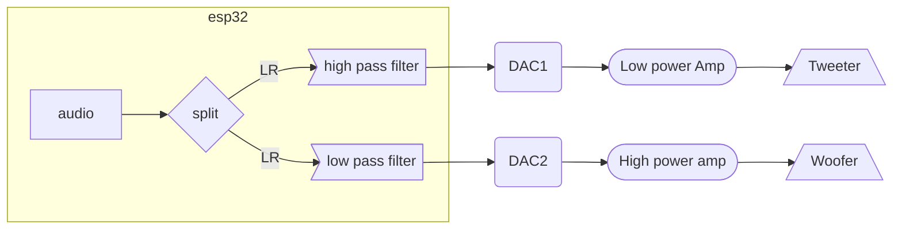
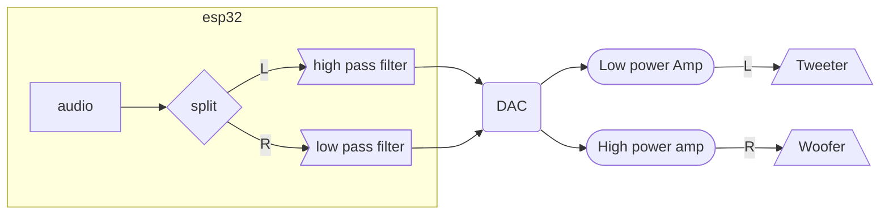
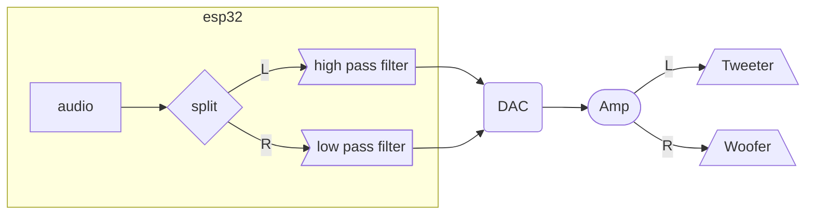

## Possible components
- DAC: [[WM8524]] 
- DAC: [[PCM1680]] (don't really like this one)
- AMP [[TAS5342A]]

## Configuration ideas

**2DAC 2AMP**

```mermaid
flowchart LR
subgraph esp32
	audio --> sp{split} -- LR --> f1>high pass filter] & f2>low pass filter] 
end
f1 --> d1(DAC1)
f2 --> d2(DAC2)

d1 --> lpa([Low power Amp])
lpa --> tw[/Tweeter\]

d2  --> hpa([High power amp])
hpa --> wof[/Woofer\]
```

**1DAC 2AMP**

```mermaid
flowchart LR
subgraph esp32
	audio --> sp{split} -- L --> f1>high pass filter] 
	sp -- R --> f2>low pass filter] 
	
end
f1 & f2--> d(DAC)

d --> lpa([Low power Amp])
lpa -- L --> tw[/Tweeter\]

d  --> hpa([High power amp])
hpa -- R --> wof[/Woofer\]
```
**1DAC 1AMP**

```mermaid
flowchart LR
subgraph esp32
	audio --> sp{split} -- L --> f1>high pass filter] 
	sp -- R --> f2>low pass filter] 
	
end
f1 & f2--> d(DAC)

d --> a([Amp])
a -- L --> tw[/Tweeter\]
a -- R --> wof[/Woofer\]
```

